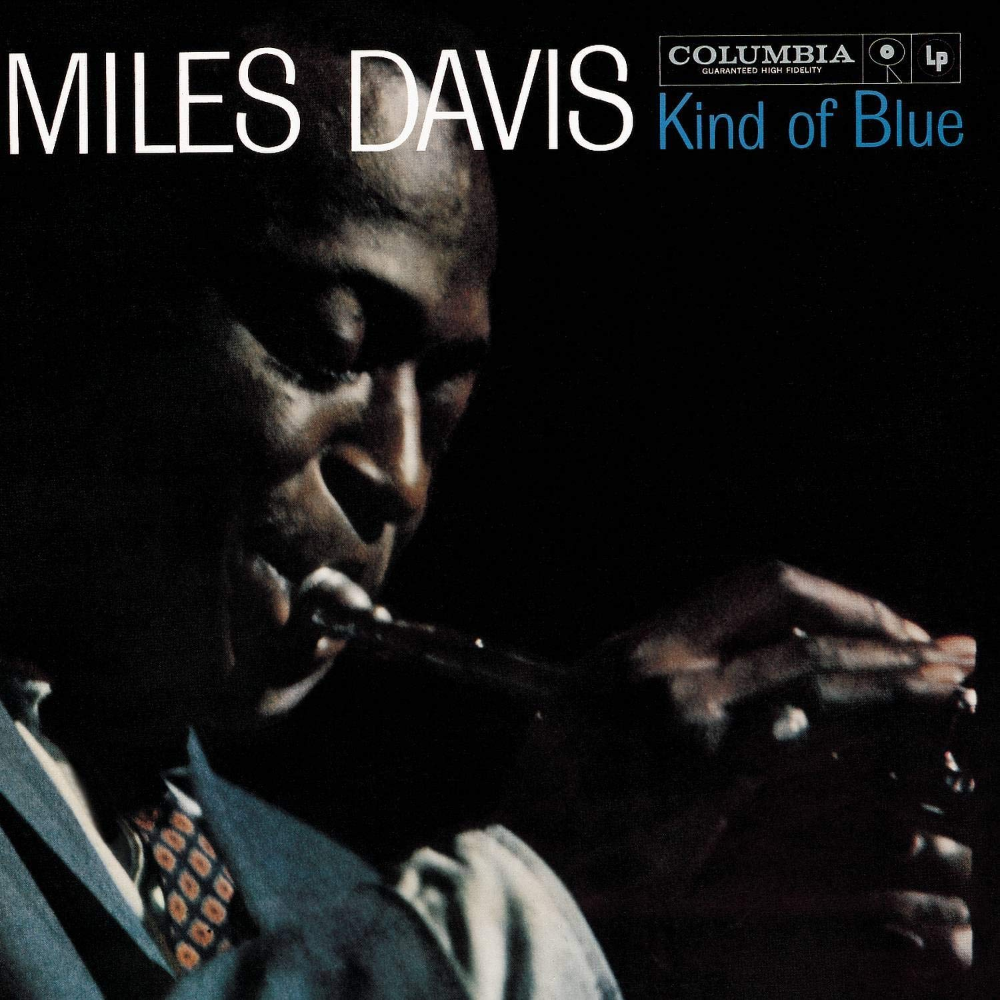
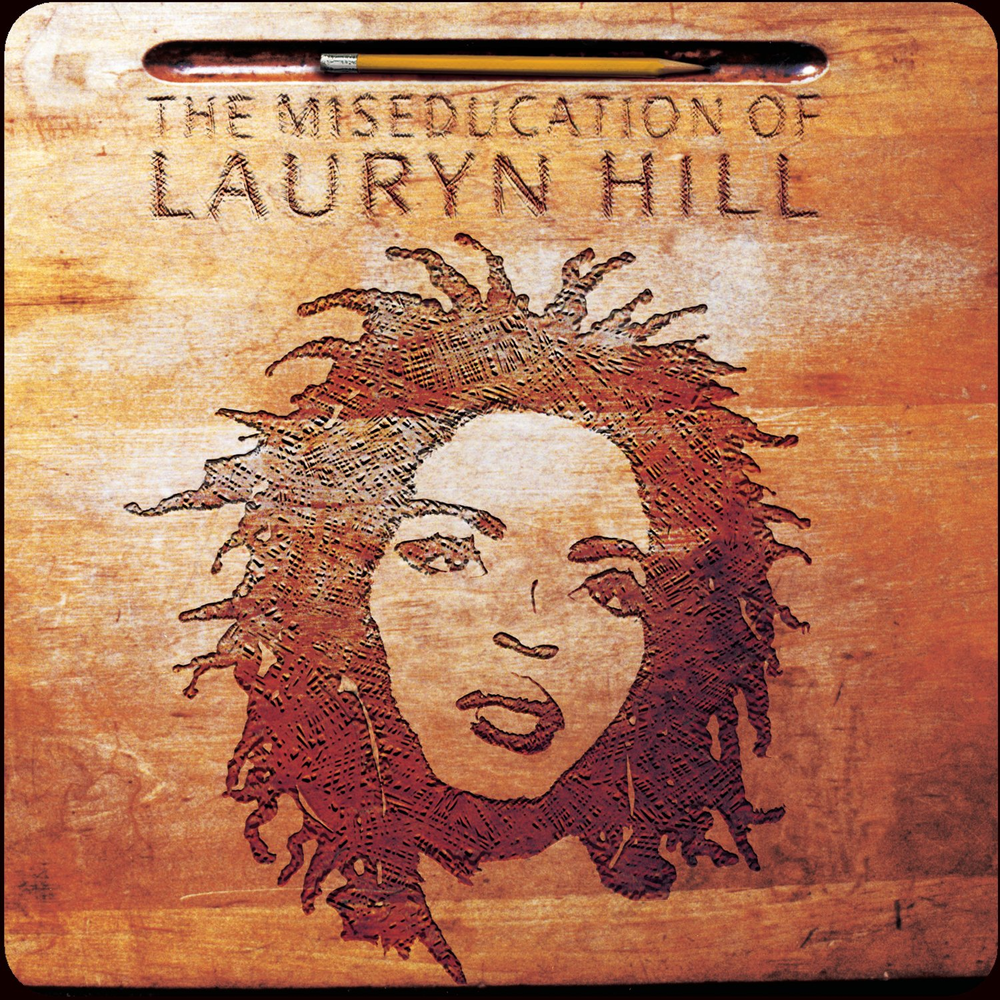

<!DOCTYPE html PUBLIC "-//W3C//DTD XHTML 1.0 Strict//EN"
"http://www.w3.org/TR/xhtml1/DTD/xhtml1-strict.dtd">
<html xmlns="http://www.w3.org/1999/xhtml">
	<head>
		<meta http-equiv="Content-Type" content="text/html; charset=utf-8"/>
		
		<title>The Top: Albums</title>
		
		<link rel="shortcut icon" type="image/jpg" href="images/favicon.ico"/>
	
		<link rel="stylesheet" type="text/css" href="css/thetop.css"/>
	</head>
	<body>
		

			

				<h1> The Top: Albums</h1>
				
				
			
				<h2>30. Black Sabbath - Black Sabbath (1970)</h2>
				
				
				<h2>29. James Brown - Sex Machine (1970)</h2>
				
				
				<h2>28. Motion City Soundtrack - Commit This to Memory (2005)</h2>
				
				
				<h2>27. Ramones - Ramones (1976)</h2>
				
				
				<h2>26. Tame Impala - Currents (2015)</h2>
				
				
				<h2>25. Madvillain - Madvillainy (2004)</h2>
				
				
				<h2>24. The Jimi Hendrix Experience - Axis: Bold as Love (1967)</h2>
				
				
				<h2>23. The Beatles - Rubber Soul (1965)</h2>
				
				
				<h2>22. Michael Jackson - Off the Wall (1979)</h2>
				
				
				<h2>21. The Apples in Stereo - Travellers in Space and Time (2010)</h2>
				
				
				<h2>20. Yes - The Yes Album (1971)</h2>
				
				
				<h2>19. Miles Davis - Kind of Blue (1959)</h2>
				
				
				<h2>18. Prince - 1999 (1982)</h2>
				
				
				<h2>17. Sufjan Stevens - Illinois (2005)</h2>
				
				
				<h2>16. Yes - Close to the Edge (1972)</h2>
				
				
				<h2>15. Bon Iver - For Emma, Forever Ago (2007)</h2>
				
				
				<h2>14. Radiohead - OK Computer (1997)</h2>
				
				
				<h2>13. Michael Jackson - Thriller (1982)</h2>
				
				
				<h2>12. Prince &amp; the Revolution - Purple Rain (1984)</h2>
				
				
				<h2>11. Yuck - Yuck (2011)</h2>
				
				
				<h2>10. R.E.M. - Murmur (1983)</h2>
				
				
				<h2>9. Marvin Gaye - What's Going On (1971)</h2>
				
				
				<h2>8. Joey Bada$$ - 1999 (2012)</h2>
				
				
				<h2>7. My Bloody Valentine - Loveless (1991)</h2>
				
				
				<h2>6. Creedence Clearwater Revival - Green River (1969)</h2>
				
				
				<h2>5. The Roots - Illadelph Halflife (1996)</h2>
				
				
				<h2>4. Smokey Robinson &amp; the Miracles - Going to a Go-Go (1965)</h2>
				
				
				<h2>3. Lauryn Hill - The Miseducation of Lauryn Hill (1998)</h2>
				
				
				<h2>2. King Crimson - In the Court of the Crimson King (1969)</h2>
				
				
				<h2>1. Rage Against the Machine - Rage Against the Machine (1992)</h2>
				
			

		

	</body>
</html>